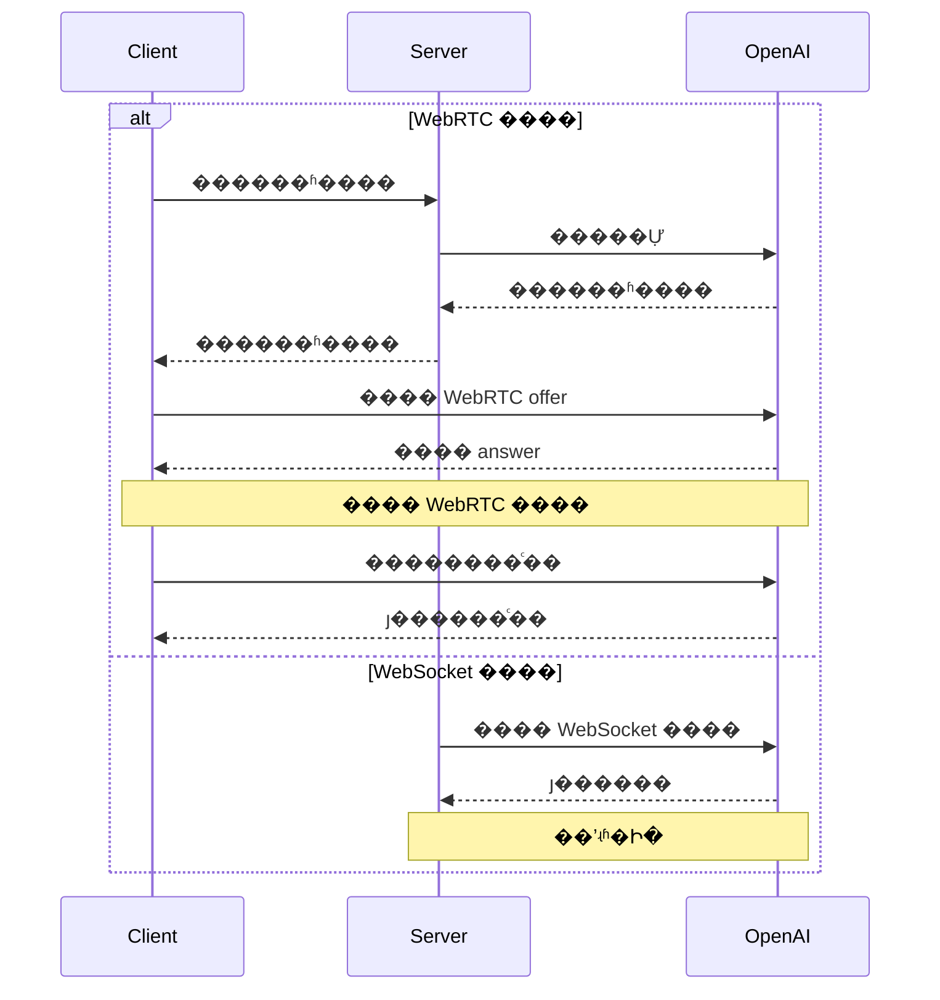

<Callout type="info" title="官方文档">
  - [OpenAI Realtime
  WebRTC](https://platform.openai.com/docs/guides/realtime-webrtc) - [OpenAI
  Realtime
  WebSocket](https://platform.openai.com/docs/guides/realtime-websocket)
</Callout>

## ?? ����

### ���

OpenAI Realtime API �ṩ�������ӷ�ʽ��

1. WebRTC - ��������������ƶ��ͻ��˵�ʵʱ����Ƶ����

2. WebSocket - �����ڷ���������������Ӧ�ó��򼯳�

### ʹ�ó���

- ʵʱ�����Ի�
- ����Ƶ����
- ʵʱ����
- ����תд
- ʵʱ��������
- ��������ʵʱ����

### ��Ҫ����

- ˫����Ƶ������
- �ı�����Ƶ��϶Ի�
- ��������֧��
- �Զ��������(VAD)
- ��Ƶתд����
- WebSocket �������˼���

## ?? ��֤�밲ȫ

### ��֤��ʽ

1. ��׼ API ��Կ (����������ʹ��)
2. ��ʱ���� (�ͻ���ʹ��)

### ��ʱ����

- ����: 1����
- ʹ������: ��������
- ��ȡ��ʽ: ͨ���������� API ����

```http
POST https://���newapi��������ַ/v1/realtime/sessions
Content-Type: application/json
Authorization: Bearer $NEW_API_KEY

{
  "model": "gpt-4o-realtime-preview-2024-12-17",
  "voice": "verse"
}
```

### ��ȫ����

- ��Զ��Ҫ�ڿͻ��˱�¶��׼ API ��Կ
- ʹ�� HTTPS/WSS ����ͨ��
- ʵ���ʵ��ķ��ʿ���
- ����쳣�

## ?? ���ӽ���

### WebRTC ����

- URL: `https://���newapi��������ַ/v1/realtime`
- ��ѯ����: `model`
- ����ͷ:
  - `Authorization: Bearer EPHEMERAL_KEY`
  - `Content-Type: application/sdp`

### WebSocket ����

- URL: `wss://���newapi��������ַ/v1/realtime`
- ��ѯ����: `model`
- ����ͷ:
  - `Authorization: Bearer YOUR_API_KEY`
  - `OpenAI-Beta: realtime=v1`

### ��������



### ����ͨ��

- ����: `oai-events`
- ��;: �¼�����
- ��ʽ: JSON

### ��Ƶ��

- ����: `addTrack()`
- ���: `ontrack` �¼�

## ?? �Ի�����

### �Ի�ģʽ

1. ���ı��Ի�
2. �����Ի�
3. ��϶Ի�

### �Ự����

- �����Ự
- ���»Ự
- �����Ự
- �Ự����

### �¼�����

- �ı��¼�
- ��Ƶ�¼�
- ��������
- ״̬����
- �����¼�

## ?? ����ѡ��

### ��Ƶ����

- �����ʽ
  - `pcm16`
  - `g711_ulaw`
  - `g711_alaw`
- �����ʽ
  - `pcm16`
  - `g711_ulaw`
  - `g711_alaw`
- ��������
  - `alloy`
  - `echo`
  - `shimmer`

### ģ������

- �¶�
- ����������
- ϵͳ��ʾ��
- ��������

### VAD ����

- ��ֵ
- ����ʱ��
- ǰ׺���

## ?? ����ʾ��

### WebRTC ���� ?

#### �ͻ���ʵ�� (�����)

```javascript
async function init() {
  // �ӷ�������ȡ��ʱ��Կ - �μ��·�����������
  const tokenResponse = await fetch('/session');
  const data = await tokenResponse.json();
  const EPHEMERAL_KEY = data.client_secret.value;

  // �����Ե�����
  const pc = new RTCPeerConnection();

  // ���ò���ģ�ͷ��ص�Զ����Ƶ
  const audioEl = document.createElement('audio');
  audioEl.autoplay = true;
  pc.ontrack = (e) => (audioEl.srcObject = e.streams[0]);

  // �����������˷�����ı�����Ƶ���
  const ms = await navigator.mediaDevices.getUserMedia({
    audio: true,
  });
  pc.addTrack(ms.getTracks()[0]);

  // �������ڷ��ͺͽ����¼�������ͨ��
  const dc = pc.createDataChannel('oai-events');
  dc.addEventListener('message', (e) => {
    // �������ʵʱ�������¼���
    console.log(e);
  });

  // ʹ�ûỰ����Э��(SDP)�����Ự
  const offer = await pc.createOffer();
  await pc.setLocalDescription(offer);

  const baseUrl = 'https://���newapi��������ַ/v1/realtime';
  const model = 'gpt-4o-realtime-preview-2024-12-17';
  const sdpResponse = await fetch(`${baseUrl}?model=${model}`, {
    method: 'POST',
    body: offer.sdp,
    headers: {
      Authorization: `Bearer ${EPHEMERAL_KEY}`,
      'Content-Type': 'application/sdp',
    },
  });

  const answer = {
    type: 'answer',
    sdp: await sdpResponse.text(),
  };
  await pc.setRemoteDescription(answer);
}

init();
```

#### ��������ʵ�� (Node.js)

```javascript
import express from 'express';

const app = express();

// ����һ���˵�����������ʱ����
// �ö˵�������Ŀͻ��˴������ʹ��
app.get('/session', async (req, res) => {
  const r = await fetch('https://���newapi��������ַ/v1/realtime/sessions', {
    method: 'POST',
    headers: {
      Authorization: `Bearer ${process.env.NEW_API_KEY}`,
      'Content-Type': 'application/json',
    },
    body: JSON.stringify({
      model: 'gpt-4o-realtime-preview-2024-12-17',
      voice: 'verse',
    }),
  });
  const data = await r.json();

  // ����OpenAI REST API�յ���JSON���ͻؿͻ���
  res.send(data);
});

app.listen(3000);
```

#### WebRTC �¼��շ�ʾ��

```javascript
// �ӶԵ����Ӵ�������ͨ��
const dc = pc.createDataChannel('oai-events');

// ��������ͨ���ϵķ������¼�
// �¼�������Ҫ��JSON�ַ�������
dc.addEventListener('message', (e) => {
  const realtimeEvent = JSON.parse(e.data);
  console.log(realtimeEvent);
});

// ���Ϳͻ����¼�������Ч�Ŀͻ����¼����л�Ϊ
// JSON����ͨ������ͨ������
const responseCreate = {
  type: 'response.create',
  response: {
    modalities: ['text'],
    instructions: 'Write a haiku about code',
  },
};
dc.send(JSON.stringify(responseCreate));
```

### WebSocket ���� ?

#### Node.js (wsģ��)

```javascript
import WebSocket from 'ws';

const url =
  'wss://���newapi��������ַ/v1/realtime?model=gpt-4o-realtime-preview-2024-12-17';
const ws = new WebSocket(url, {
  headers: {
    Authorization: 'Bearer ' + process.env.NEW_API_KEY,
    'OpenAI-Beta': 'realtime=v1',
  },
});

ws.on('open', function open() {
  console.log('Connected to server.');
});

ws.on('message', function incoming(message) {
  console.log(JSON.parse(message.toString()));
});
```

#### Python (websocket-client)

```python
# ��Ҫ��װ websocket-client ��:
# pip install websocket-client

import os
import json
import websocket

NEW_API_KEY = os.environ.get("NEW_API_KEY")

url = "wss://���newapi��������ַ/v1/realtime?model=gpt-4o-realtime-preview-2024-12-17"
headers = [
    "Authorization: Bearer " + NEW_API_KEY,
    "OpenAI-Beta: realtime=v1"
]

def on_open(ws):
    print("Connected to server.")

def on_message(ws, message):
    data = json.loads(message)
    print("Received event:", json.dumps(data, indent=2))

ws = websocket.WebSocketApp(
    url,
    header=headers,
    on_open=on_open,
    on_message=on_message,
)

ws.run_forever()
```

#### ����� (��׼WebSocket)

```javascript
/*
ע�⣺��������ȿͻ��˻����У����ǽ���ʹ��WebRTC��
����Deno��Cloudflare Workers���������������
Ҳ����ʹ�ñ�׼WebSocket�ӿڡ�
*/

const ws = new WebSocket(
  'wss://���newapi��������ַ/v1/realtime?model=gpt-4o-realtime-preview-2024-12-17',
  [
    'realtime',
    // ��֤
    'openai-insecure-api-key.' + NEW_API_KEY,
    // ��ѡ
    'openai-organization.' + OPENAI_ORG_ID,
    'openai-project.' + OPENAI_PROJECT_ID,
    // BetaЭ�飬����
    'openai-beta.realtime-v1',
  ]
);

ws.on('open', function open() {
  console.log('Connected to server.');
});

ws.on('message', function incoming(message) {
  console.log(message.data);
});
```

#### ��Ϣ�շ�ʾ��

##### Node.js/�����

```javascript
// ���շ������¼�
ws.on('message', function incoming(message) {
  // ��Ҫ��JSON������Ϣ����
  const serverEvent = JSON.parse(message.data);
  console.log(serverEvent);
});

// �����¼����������Ͽͻ����¼���ʽ��JSON���ݽṹ
const event = {
  type: 'response.create',
  response: {
    modalities: ['audio', 'text'],
    instructions: 'Give me a haiku about code.',
  },
};
ws.send(JSON.stringify(event));
```

##### Python

```python
# ���Ϳͻ����¼������ֵ����л�ΪJSON
def on_open(ws):
    print("Connected to server.")

    event = {
        "type": "response.create",
        "response": {
            "modalities": ["text"],
            "instructions": "Please assist the user."
        }
    }
    ws.send(json.dumps(event))

# ������Ϣ��Ҫ��JSON������Ϣ����
def on_message(ws, message):
    data = json.loads(message)
    print("Received event:", json.dumps(data, indent=2))
```

## ?? ������

### ��������

1. ���Ӵ���
   - ��������
   - ��֤ʧ��
   - ����
2. ��Ƶ����
   - �豸Ȩ��
   - ��ʽ��֧��
   - ���������
3. �Ự����
   - ���ƹ���
   - �Ự��ʱ
   - ��������

### ����ָ�

1. �Զ�����
2. �Ự�ָ�
3. ��������
4. ��������

## ?? �¼��ο�

### ͨ������ͷ

�����¼�����Ҫ������������ͷ:

| ����ͷ         | ����  | ˵��     | ʾ��ֵ                |
| ------------- | ----- | ------- | ------------------- |
| Authorization | �ַ��� | ��֤���� | Bearer $NEW_API_KEY |
| OpenAI-Beta   | �ַ��� | API �汾 | realtime=v1         |

### �ͻ����¼�

#### session.update

���»Ự��Ĭ�����á�

| ����                               | ����       | ���� | ˵��                  | ʾ��ֵ/��ѡֵ                             |
| ---------------------------------- | ---------- | ---- | -------------------- | ------------------------------------- |
| event_id                           | �ַ���      | ��   | �ͻ������ɵ��¼���ʶ��   | event_123                             |
| type                               | �ַ���      | ��   | �¼�����              | session.update                        |
| modalities                         | �ַ�������  | ��   | ģ�Ϳ�����Ӧ��ģ̬����     | ["text", "audio"]                     |
| instructions                       | �ַ���      | ��   | Ԥ�õ�ģ�͵���ǰ��ϵͳָ��   | "Your knowledge cutoff is 2023-10..." |
| voice                              | �ַ���      | ��   | ģ��ʹ�õ���������      | alloy��echo��shimmer                  |
| input_audio_format                 | �ַ���      | ��   | ������Ƶ��ʽ           | pcm16��g711_ulaw��g711_alaw           |
| output_audio_format                | �ַ���      | ��   | �����Ƶ��ʽ            | pcm16��g711_ulaw��g711_alaw           |
| input_audio_transcription.model    | �ַ���      | ��   | ����תд��ģ��          | whisper-1                             |
| turn_detection.type                | �ַ���      | ��   | �����������          | server_vad                            |
| turn_detection.threshold           | ����       | ��   | VAD ������ֵ(0.0-1.0) | 0.8                                   |
| turn_detection.prefix_padding_ms   | ����       | ��   | ������ʼǰ��������Ƶʱ�� | 500                                   |
| turn_detection.silence_duration_ms | ����       | ��   | �������ֹͣ�ľ�������ʱ�� | 1000                                  |
| tools                              | ����       | ��   | ģ�Ϳ��õĹ����б�        | []                                    |
| tool_choice                        | �ַ���      | ��   | ģ��ѡ�񹤾ߵķ�ʽ           | auto/none/required                    |
| temperature                        | ����       | ��   | ģ�Ͳ����¶�            | 0.8                                   |
| max_output_tokens                  | �ַ���/���� | ��   | ������Ӧ���token��    | "inf"/4096                            |

#### input_audio_buffer.append

��������Ƶ������׷����Ƶ���ݡ�

| ����     | ����  | ���� | ˵��                | ʾ��ֵ                      |
| -------- | ----- | ---- | ------------------ | ------------------------- |
| event_id | �ַ��� | ��   | �ͻ������ɵ��¼���ʶ�� | event_456                 |
| type     | �ַ��� | ��   | �¼�����            | input_audio_buffer.append |
| audio    | �ַ��� | ��   | Base64�������Ƶ���� | Base64EncodedAudioData    |

#### input_audio_buffer.commit

���������е���Ƶ�����ύΪ�û���Ϣ��

| ����     | ����  | ���� | ˵��                | ʾ��ֵ                      |
| -------- | ----- | ---- | ------------------ | ------------------------- |
| event_id | �ַ��� | ��   | �ͻ������ɵ��¼���ʶ�� | event_789                 |
| type     | �ַ��� | ��   | �¼�����            | input_audio_buffer.commit |

#### input_audio_buffer.clear

���������Ƶ�������е�������Ƶ���ݡ�

| ����     | ����  | ���� | ˵��                | ʾ��ֵ                     |
| -------- | ----- | ---- | ------------------ | ------------------------ |
| event_id | �ַ��� | ��   | �ͻ������ɵ��¼���ʶ�� | event_012                |
| type     | �ַ��� | ��   | �¼�����            | input_audio_buffer.clear |

#### conversation.item.create

��Ի��������µĶԻ��

| ����             | ����  | ���� | ˵��                | ʾ��ֵ                                       |
| ---------------- | ----- | ---- | ------------------ | ------------------------------------------ |
| event_id         | �ַ��� | ��   | �ͻ������ɵ��¼���ʶ�� | event_345                                  |
| type             | �ַ��� | ��   | �¼�����            | conversation.item.create                   |
| previous_item_id | �ַ��� | ��   | �¶Ի�������ڴ�ID֮�� | null                                       |
| item.id          | �ַ��� | ��   | �Ի����Ψһ��ʶ��      | msg_001                                    |
| item.type        | �ַ��� | ��   | �Ի�������          | message/function_call/function_call_output |
| item.status      | �ַ��� | ��   | �Ի���״̬             | completed/in_progress/incomplete           |
| item.role        | �ַ��� | ��   | ��Ϣ�����ߵĽ�ɫ       | user/assistant/system                      |
| item.content     | ����  | ��   | ��Ϣ����            | [text/audio/transcript]                    |
| item.call_id     | �ַ��� | ��   | �������õ�ID        | call_001                                   |
| item.name        | �ַ��� | ��   | �����õĺ�������     | function_name                              |
| item.arguments   | �ַ��� | ��   | �������õIJ���       | {"param": "value"}                         |
| item.output      | �ַ��� | ��   | �������õ�������    | {"result": "value"}                        |

#### conversation.item.truncate

�ض�������Ϣ�е���Ƶ���ݡ�

| ����          | ����  | ���� | ˵��                | ʾ��ֵ                       |
| ------------- | ----- | ---- | ------------------ | -------------------------- |
| event_id      | �ַ��� | ��   | �ͻ������ɵ��¼���ʶ�� | event_678                  |
| type          | �ַ��� | ��   | �¼�����            | conversation.item.truncate |
| item_id       | �ַ��� | ��   | Ҫ�ضϵ�������Ϣ���ID  | msg_002                    |
| content_index | ����  | ��   | Ҫ�ضϵ����ݲ��ֵ�����  | 0                          |
| audio_end_ms  | ����  | ��   | ��Ƶ�ضϵĽ���ʱ���     | 1500                       |

#### conversation.item.delete

�ӶԻ���ʷ��ɾ��ָ���ĶԻ��

| ����     | ����  | ���� | ˵��                | ʾ��ֵ                     |
| -------- | ----- | ---- | ------------------ | ------------------------ |
| event_id | �ַ��� | ��   | �ͻ������ɵ��¼���ʶ�� | event_901                |
| type     | �ַ��� | ��   | �¼�����            | conversation.item.delete |
| item_id  | �ַ��� | ��   | Ҫɾ���ĶԻ����ID      | msg_003                  |

#### response.create

������Ӧ���ɡ�

| ����                         | ����       | ���� | ˵��                | ʾ��ֵ                            |
| ---------------------------- | ---------- | ---- | ------------------ | ------------------------------- |
| event_id                     | �ַ���      | ��   | �ͻ������ɵ��¼���ʶ�� | event_234                       |
| type                         | �ַ���      | ��   | �¼�����            | response.create                 |
| response.modalities          | �ַ�������  | ��   | ��Ӧ��ģ̬����         | ["text", "audio"]               |
| response.instructions        | �ַ���      | ��   | ��ģ�͵�ָ��          | "Please assist the user."       |
| response.voice               | �ַ���      | ��   | ģ��ʹ�õ���������    | alloy/echo/shimmer              |
| response.output_audio_format | �ַ���      | ��   | �����Ƶ��ʽ          | pcm16                           |
| response.tools               | ����       | ��   | ģ�Ϳ��õĹ����б�      | ["type", "name", "description"] |
| response.tool_choice         | �ַ���      | ��   | ģ��ѡ�񹤾ߵķ�ʽ         | auto                            |
| response.temperature         | ����       | ��   | �����¶�            | 0.7                             |
| response.max_output_tokens   | ����/�ַ��� | ��   | ������token��      | 150/"inf"                       |

#### response.cancel

ȡ�����ڽ����е���Ӧ���ɡ�

| ����     | ����  | ���� | ˵��                | ʾ��ֵ            |
| -------- | ----- | ---- | ------------------ | --------------- |
| event_id | �ַ��� | ��   | �ͻ������ɵ��¼���ʶ�� | event_567       |
| type     | �ַ��� | ��   | �¼�����            | response.cancel |

### ������¼�

#### error

����������ʱ���ص��¼���

| ����           | ����      | ���� | ˵��               | ʾ��ֵ                               |
| -------------- | --------- | ---- | ----------------- | ---------------------------------- |
| event_id       | �ַ������� | ��   | ������¼���Ψһ��ʶ�� | ["event_890"]                      |
| type           | �ַ���     | ��   | �¼�����           | error                              |
| error.type     | �ַ���     | ��   | ��������          | invalid_request_error/server_error |
| error.code     | �ַ���     | ��   | �������           | invalid_event                      |
| error.message  | �ַ���     | ��   | ����ɶ��Ĵ�����Ϣ    | "The 'type' field is missing."     |
| error.param    | �ַ���     | ��   | �������صIJ���      | null                               |
| error.event_id | �ַ���     | ��   | ����¼���ID        | event_567                          |

#### conversation.item.input_audio_transcription.completed

������������Ƶתд���ܲ���תд�ɹ�ʱ���ش��¼���

| ����          | ����  | ���� | ˵��                   | ʾ��ֵ                                                  |
| ------------- | ----- | ---- | --------------------- | ----------------------------------------------------- |
| event_id      | �ַ��� | ��   | ������¼���Ψһ��ʶ��     | event_2122                                            |
| type          | �ַ��� | ��   | �¼�����               | conversation.item.input_audio_transcription.completed |
| item_id       | �ַ��� | ��   | �û���Ϣ���ID           | msg_003                                               |
| content_index | ����  | ��   | ������Ƶ�����ݲ��ֵ����� | 0                                                     |
| transcript    | �ַ��� | ��   | תд���ı�����           | "Hello, how are you?"                                 |

#### conversation.item.input_audio_transcription.failed

��������������Ƶתд����,���û���Ϣ��תд����ʧ��ʱ���ش��¼���

| ����          | ����      | ���� | ˵��                   | ʾ��ֵ                                                   |
| ------------- | --------- | ---- | --------------------- | ------------------------------------------------------ |
| event_id      | �ַ���     | ��   | ������¼���Ψһ��ʶ��     | event_2324                                             |
| type          | �ַ������� | ��   | �¼�����               | ["conversation.item.input_audio_transcription.failed"] |
| item_id       | �ַ���     | ��   | �û���Ϣ���ID           | msg_003                                                |
| content_index | ����      | ��   | ������Ƶ�����ݲ��ֵ����� | 0                                                      |
| error.type    | �ַ���     | ��   | ��������              | transcription_error                                    |
| error.code    | �ַ���     | ��   | �������               | audio_unintelligible                                   |
| error.message | �ַ���     | ��   | ����ɶ��Ĵ�����Ϣ        | "The audio could not be transcribed."                  |
| error.param   | �ַ���     | ��   | �������صIJ���          | null                                                   |

#### conversation.item.truncated

���ͻ��˽ض���֮ǰ��������Ƶ��Ϣ��ʱ���ش��¼���

| ����          | ����  | ���� | ˵��                 | ʾ��ֵ                        |
| ------------- | ----- | ---- | ------------------- | --------------------------- |
| event_id      | �ַ��� | ��   | ������¼���Ψһ��ʶ��   | event_2526                  |
| type          | �ַ��� | ��   | �¼�����             | conversation.item.truncated |
| item_id       | �ַ��� | ��   | ���ضϵ�������Ϣ���ID  | msg_004                     |
| content_index | ����  | ��   | ���ضϵ����ݲ��ֵ�����  | 0                           |
| audio_end_ms  | ����  | ��   | ��Ƶ���ضϵ�ʱ���(����) | 1500                        |

#### conversation.item.deleted

���Ի��е�ij����Ŀ��ɾ��ʱ���ش��¼���

| ����     | ����  | ���� | ˵��               | ʾ��ֵ                      |
| -------- | ----- | ---- | ----------------- | ------------------------- |
| event_id | �ַ��� | ��   | ������¼���Ψһ��ʶ�� | event_2728                |
| type     | �ַ��� | ��   | �¼�����           | conversation.item.deleted |
| item_id  | �ַ��� | ��   | ��ɾ���ĶԻ����ID    | msg_005                   |

#### input_audio_buffer.committed

����Ƶ�������е����ݱ��ύʱ���ش��¼���

| ����             | ����  | ���� | ˵��                         | ʾ��ֵ                         |
| ---------------- | ----- | ---- | --------------------------- | ---------------------------- |
| event_id         | �ַ��� | ��   | ������¼���Ψһ��ʶ��           | event_1121                   |
| type             | �ַ��� | ��   | �¼�����                     | input_audio_buffer.committed |
| previous_item_id | �ַ��� | ��   | �¶Ի�������ڴ�ID��Ӧ�ĶԻ���֮�� | msg_001                      |
| item_id          | �ַ��� | ��   | ��Ҫ�������û���Ϣ���ID        | msg_002                      |

#### input_audio_buffer.cleared

���ͻ������������Ƶ������ʱ���ش��¼���

| ����     | ����  | ���� | ˵��               | ʾ��ֵ                       |
| -------- | ----- | ---- | ----------------- | -------------------------- |
| event_id | �ַ��� | ��   | ������¼���Ψһ��ʶ�� | event_1314                 |
| type     | �ַ��� | ��   | �¼�����           | input_audio_buffer.cleared |

#### input_audio_buffer.speech_started

�ڷ������������ģʽ�£�����⵽��������ʱ���ش��¼���

| ����           | ����  | ���� | ˵��                       | ʾ��ֵ                              |
| -------------- | ----- | ---- | ------------------------- | --------------------------------- |
| event_id       | �ַ��� | ��   | ������¼���Ψһ��ʶ��         | event_1516                        |
| type           | �ַ��� | ��   | �¼�����                   | input_audio_buffer.speech_started |
| audio_start_ms | ����  | ��   | �ӻỰ��ʼ����⵽�����ĺ�����    | 1000                              |
| item_id        | �ַ��� | ��   | ����ֹͣʱ���������û���Ϣ���ID | msg_003                           |

#### input_audio_buffer.speech_stopped

�ڷ������������ģʽ�£�����⵽��������ֹͣʱ���ش��¼���

| ����           | ����  | ���� | ˵��                     | ʾ��ֵ                              |
| -------------- | ----- | ---- | ----------------------- | --------------------------------- |
| event_id       | �ַ��� | ��   | ������¼���Ψһ��ʶ��       | event_1718                        |
| type           | �ַ��� | ��   | �¼�����                 | input_audio_buffer.speech_stopped |
| audio_start_ms | ����  | ��   | �ӻỰ��ʼ����⵽����ֹͣ�ĺ����� | 2000                              |
| item_id        | �ַ��� | ��   | ��Ҫ�������û���Ϣ���ID    | msg_003                           |

#### response.created

�������µ���Ӧʱ���ش��¼���

| ����                    | ����      | ���� | ˵��               | ʾ��ֵ              |
| ----------------------- | --------- | ---- | ----------------- | ----------------- |
| event_id                | �ַ���     | ��   | ������¼���Ψһ��ʶ�� | event_2930        |
| type                    | �ַ���     | ��   | �¼�����           | response.created  |
| response.id             | �ַ���     | ��   | ��Ӧ��Ψһ��ʶ��      | resp_001          |
| response.object         | �ַ���     | ��   | ��������          | realtime.response |
| response.status         | �ַ���     | ��   | ��Ӧ��״̬            | in_progress       |
| response.status_details | ����      | ��   | ״̬�ĸ�����ϸ��Ϣ      | null              |
| response.output         | �ַ������� | ��   | ��Ӧ���ɵ�������б�  | ["[]"]            |
| response.usage          | ����      | ��   | ��Ӧ��ʹ��ͳ����Ϣ    | null              |

#### response.done

����Ӧ�����ʽ����ʱ���ش��¼���

| ����                         | ����      | ���� | ˵��               | ʾ��ֵ                                  |
| ---------------------------- | --------- | ---- | ----------------- | ------------------------------------- |
| event_id                     | �ַ���     | ��   | ������¼���Ψһ��ʶ�� | event_3132                            |
| type                         | �ַ���     | ��   | �¼�����           | response.done                         |
| response.id                  | �ַ���     | ��   | ��Ӧ��Ψһ��ʶ��      | resp_001                              |
| response.object              | �ַ���     | ��   | ��������          | realtime.response                     |
| response.status              | �ַ���     | ��   | ��Ӧ������״̬        | completed/cancelled/failed/incomplete |
| response.status_details      | ����      | ��   | ״̬�ĸ�����ϸ��Ϣ      | null                                  |
| response.output              | �ַ������� | ��   | ��Ӧ���ɵ�������б�  | ["[...]"]                             |
| response.usage.total_tokens  | ����      | ��   | ��token��         | 50                                    |
| response.usage.input_tokens  | ����      | ��   | ����token��       | 20                                    |
| response.usage.output_tokens | ����      | ��   | ���token��        | 30                                    |

#### response.output_item.added

����Ӧ���ɹ����д����µ������ʱ���ش��¼���

| ����         | ����  | ���� | ˵��               | ʾ��ֵ                                       |
| ------------ | ----- | ---- | ----------------- | ------------------------------------------ |
| event_id     | �ַ��� | ��   | ������¼���Ψһ��ʶ�� | event_3334                                 |
| type         | �ַ��� | ��   | �¼�����           | response.output_item.added                 |
| response_id  | �ַ��� | ��   | �������������ӦID  | resp_001                                   |
| output_index | �ַ��� | ��   | ���������Ӧ�е����� | 0                                          |
| item.id      | �ַ��� | ��   | ������Ψһ��ʶ��     | msg_007                                    |
| item.object  | �ַ��� | ��   | ��������          | realtime.item                              |
| item.type    | �ַ��� | ��   | ���������         | message/function_call/function_call_output |
| item.status  | �ַ��� | ��   | �����״̬            | in_progress/completed                      |
| item.role    | �ַ��� | ��   | �����������Ľ�ɫ    | assistant                                  |
| item.content | ����  | ��   | ����������        | ["type", "text", "audio", "transcript"]    |

#### response.output_item.done

������������ʽ����ʱ���ش��¼���

| ����         | ����  | ���� | ˵��               | ʾ��ֵ                                       |
| ------------ | ----- | ---- | ----------------- | ------------------------------------------ |
| event_id     | �ַ��� | ��   | ������¼���Ψһ��ʶ�� | event_3536                                 |
| type         | �ַ��� | ��   | �¼�����           | response.output_item.done                  |
| response_id  | �ַ��� | ��   | �������������ӦID  | resp_001                                   |
| output_index | �ַ��� | ��   | ���������Ӧ�е����� | 0                                          |
| item.id      | �ַ��� | ��   | ������Ψһ��ʶ��     | msg_007                                    |
| item.object  | �ַ��� | ��   | ��������          | realtime.item                              |
| item.type    | �ַ��� | ��   | ���������         | message/function_call/function_call_output |
| item.status  | �ַ��� | ��   | ����������״̬       | completed/incomplete                       |
| item.role    | �ַ��� | ��   | �����������Ľ�ɫ    | assistant                                  |
| item.content | ����  | ��   | ����������        | ["type", "text", "audio", "transcript"]    |

#### response.content_part.added

����Ӧ���ɹ�������������Ϣ�������µ����ݲ���ʱ���ش��¼���

| ����            | ����  | ���� | ˵��                           | ʾ��ֵ                        |
| --------------- | ----- | ---- | ----------------------------- | --------------------------- |
| event_id        | �ַ��� | ��   | ������¼���Ψһ��ʶ��             | event_3738                  |
| type            | �ַ��� | ��   | �¼�����                       | response.content_part.added |
| response_id     | �ַ��� | ��   | ��Ӧ��ID                       | resp_001                    |
| item_id         | �ַ��� | ��   | �������ݲ��ֵ���Ϣ��ID           | msg_007                     |
| output_index    | ����  | ��   | ���������Ӧ�е�����             | 0                           |
| content_index   | ����  | ��   | ���ݲ�������Ϣ�����������е����� | 0                           |
| part.type       | �ַ��� | ��   | ��������                      | text/audio                  |
| part.text       | �ַ��� | ��   | �ı�����                       | "Hello"                     |
| part.audio      | �ַ��� | ��   | Base64�������Ƶ����            | "base64_encoded_audio_data" |
| part.transcript | �ַ��� | ��   | ��Ƶ��תд�ı�                    | "Hello"                     |

#### response.content_part.done

��������Ϣ���е����ݲ��������ʽ����ʱ���ش��¼���

| ����            | ����  | ���� | ˵��                           | ʾ��ֵ                        |
| --------------- | ----- | ---- | ----------------------------- | --------------------------- |
| event_id        | �ַ��� | ��   | ������¼���Ψһ��ʶ��             | event_3940                  |
| type            | �ַ��� | ��   | �¼�����                       | response.content_part.done  |
| response_id     | �ַ��� | ��   | ��Ӧ��ID                       | resp_001                    |
| item_id         | �ַ��� | ��   | �������ݲ��ֵ���Ϣ��ID           | msg_007                     |
| output_index    | ����  | ��   | ���������Ӧ�е�����             | 0                           |
| content_index   | ����  | ��   | ���ݲ�������Ϣ�����������е����� | 0                           |
| part.type       | �ַ��� | ��   | ��������                      | text/audio                  |
| part.text       | �ַ��� | ��   | �ı�����                       | "Hello"                     |
| part.audio      | �ַ��� | ��   | Base64�������Ƶ����            | "base64_encoded_audio_data" |
| part.transcript | �ַ��� | ��   | ��Ƶ��תд�ı�                    | "Hello"                     |

#### response.text.delta

��"text"�������ݲ��ֵ��ı�ֵ����ʱ���ش��¼���

| ����          | ����  | ���� | ˵��                           | ʾ��ֵ                |
| ------------- | ----- | ---- | ----------------------------- | ------------------- |
| event_id      | �ַ��� | ��   | ������¼���Ψһ��ʶ��             | event_4142          |
| type          | �ַ��� | ��   | �¼�����                       | response.text.delta |
| response_id   | �ַ��� | ��   | ��Ӧ��ID                       | resp_001            |
| item_id       | �ַ��� | ��   | ��Ϣ���ID                      | msg_007             |
| output_index  | ����  | ��   | ���������Ӧ�е�����             | 0                   |
| content_index | ����  | ��   | ���ݲ�������Ϣ�����������е����� | 0                   |
| delta         | �ַ��� | ��   | �ı�������������               | "Sure, I can h"     |

#### response.text.done

��"text"�������ݲ��ֵ��ı���ʽ�������ʱ���ش��¼���

| ����          | ����  | ���� | ˵��                           | ʾ��ֵ                          |
| ------------- | ----- | ---- | ----------------------------- | ----------------------------- |
| event_id      | �ַ��� | ��   | ������¼���Ψһ��ʶ��             | event_4344                    |
| type          | �ַ��� | ��   | �¼�����                       | response.text.done            |
| response_id   | �ַ��� | ��   | ��Ӧ��ID                       | resp_001                      |
| item_id       | �ַ��� | ��   | ��Ϣ���ID                      | msg_007                       |
| output_index  | ����  | ��   | ���������Ӧ�е�����             | 0                             |
| content_index | ����  | ��   | ���ݲ�������Ϣ�����������е����� | 0                             |
| delta         | �ַ��� | ��   | ���յ������ı�����              | "Sure, I can help with that." |

#### response.audio_transcript.delta

��ģ�����ɵ���Ƶ���תд���ݸ���ʱ���ش��¼���

| ����          | ����  | ���� | ˵��                           | ʾ��ֵ                            |
| ------------- | ----- | ---- | ----------------------------- | ------------------------------- |
| event_id      | �ַ��� | ��   | ������¼���Ψһ��ʶ��             | event_4546                      |
| type          | �ַ��� | ��   | �¼�����                       | response.audio_transcript.delta |
| response_id   | �ַ��� | ��   | ��Ӧ��ID                       | resp_001                        |
| item_id       | �ַ��� | ��   | ��Ϣ���ID                      | msg_008                         |
| output_index  | ����  | ��   | ���������Ӧ�е�����             | 0                               |
| content_index | ����  | ��   | ���ݲ�������Ϣ�����������е����� | 0                               |
| delta         | �ַ��� | ��   | תд�ı���������������           | "Hello, how can I a"            |

#### response.audio_transcript.done

��ģ�����ɵ���Ƶ���תд�����ʽ����ʱ���ش��¼���

| ����          | ����  | ���� | ˵��                           | ʾ��ֵ                                 |
| ------------- | ----- | ---- | ----------------------------- | ------------------------------------ |
| event_id      | �ַ��� | ��   | ������¼���Ψһ��ʶ��             | event_4748                           |
| type          | �ַ��� | ��   | �¼�����                       | response.audio_transcript.done       |
| response_id   | �ַ��� | ��   | ��Ӧ��ID                       | resp_001                             |
| item_id       | �ַ��� | ��   | ��Ϣ���ID                      | msg_008                              |
| output_index  | ����  | ��   | ���������Ӧ�е�����             | 0                                    |
| content_index | ����  | ��   | ���ݲ�������Ϣ�����������е����� | 0                                    |
| transcript    | �ַ��� | ��   | ��Ƶ����������תд�ı�            | "Hello, how can I assist you today?" |

#### response.audio.delta

��ģ�����ɵ���Ƶ���ݸ���ʱ���ش��¼���

| ����          | ����  | ���� | ˵��                           | ʾ��ֵ                      |
| ------------- | ----- | ---- | ----------------------------- | ------------------------- |
| event_id      | �ַ��� | ��   | ������¼���Ψһ��ʶ��             | event_4950                |
| type          | �ַ��� | ��   | �¼�����                       | response.audio.delta      |
| response_id   | �ַ��� | ��   | ��Ӧ��ID                       | resp_001                  |
| item_id       | �ַ��� | ��   | ��Ϣ���ID                      | msg_008                   |
| output_index  | ����  | ��   | ���������Ӧ�е�����             | 0                         |
| content_index | ����  | ��   | ���ݲ�������Ϣ�����������е����� | 0                         |
| delta         | �ַ��� | ��   | Base64�������Ƶ��������        | "Base64EncodedAudioDelta" |

#### response.audio.done

��ģ�����ɵ���Ƶ���ʱ���ش��¼���

| ����          | ����  | ���� | ˵��                           | ʾ��ֵ                |
| ------------- | ----- | ---- | ----------------------------- | ------------------- |
| event_id      | �ַ��� | ��   | ������¼���Ψһ��ʶ��             | event_5152          |
| type          | �ַ��� | ��   | �¼�����                       | response.audio.done |
| response_id   | �ַ��� | ��   | ��Ӧ��ID                       | resp_001            |
| item_id       | �ַ��� | ��   | ��Ϣ���ID                      | msg_008             |
| output_index  | ����  | ��   | ���������Ӧ�е�����             | 0                   |
| content_index | ����  | ��   | ���ݲ�������Ϣ�����������е����� | 0                   |

### ��������

#### response.function_call_arguments.delta

��ģ�����ɵĺ������ò�������ʱ���ش��¼���

| ����         | ����  | ���� | ˵��                     | ʾ��ֵ                                   |
| ------------ | ----- | ---- | ----------------------- | -------------------------------------- |
| event_id     | �ַ��� | ��   | ������¼���Ψһ��ʶ��       | event_5354                             |
| type         | �ַ��� | ��   | �¼�����                 | response.function_call_arguments.delta |
| response_id  | �ַ��� | ��   | ��Ӧ��ID                 | resp_002                               |
| item_id      | �ַ��� | ��   | ��Ϣ���ID                | fc_001                                 |
| output_index | ����  | ��   | ���������Ӧ�е�����       | 0                                      |
| call_id      | �ַ��� | ��   | �������õ�ID             | call_001                               |
| delta        | �ַ��� | ��   | JSON��ʽ�ĺ������ò������� | "{\"location\": \"San\""               |

#### response.function_call_arguments.done

��ģ�����ɵĺ������ò��������ʽ����ʱ���ش��¼���

| ����         | ����  | ���� | ˵��                           | ʾ��ֵ                                  |
| ------------ | ----- | ---- | ----------------------------- | ------------------------------------- |
| event_id     | �ַ��� | ��   | ������¼���Ψһ��ʶ��             | event_5556                            |
| type         | �ַ��� | ��   | �¼�����                       | response.function_call_arguments.done |
| response_id  | �ַ��� | ��   | ��Ӧ��ID                       | resp_002                              |
| item_id      | �ַ��� | ��   | ��Ϣ���ID                      | fc_001                                |
| output_index | ����  | ��   | ���������Ӧ�е�����             | 0                                     |
| call_id      | �ַ��� | ��   | �������õ�ID                   | call_001                              |
| arguments    | �ַ��� | ��   | ���յ������������ò���(JSON��ʽ) | "{\"location\": \"San Francisco\"}"   |

### ����״̬����

#### rate_limits.updated

��ÿ�� "response.done" �¼�֮�󴥷�,����ָʾ���º���������ơ�

| ����        | ����     | ���� | ˵��               | ʾ��ֵ                                                                              |
| ----------- | -------- | ---- | ----------------- | --------------------------------------------------------------------------------- |
| event_id    | �ַ���    | ��   | ������¼���Ψһ��ʶ�� | event_5758                                                                        |
| type        | �ַ���    | ��   | �¼�����           | rate_limits.updated                                                               |
| rate_limits | �������� | ��   | ����������Ϣ�б�    | [{"name": "requests_per_min", "limit": 60, "remaining": 45, "reset_seconds": 35}] |

#### conversation.created

���Ի�����ʱ���ش��¼���

| ����         | ����  | ���� | ˵��               | ʾ��ֵ                                                  |
| ------------ | ----- | ---- | ----------------- | ----------------------------------------------------- |
| event_id     | �ַ��� | ��   | ������¼���Ψһ��ʶ�� | event_9101                                            |
| type         | �ַ��� | ��   | �¼�����           | conversation.created                                  |
| conversation | ����  | ��   | �Ի���Դ����        | {"id": "conv_001", "object": "realtime.conversation"} |

#### conversation.item.created

���Ի����ʱ���ش��¼���

| ����             | ����  | ���� | ˵��               | ʾ��ֵ                                                                                                                                                   |
| ---------------- | ----- | ---- | ----------------- | ------------------------------------------------------------------------------------------------------------------------------------------------------ |
| event_id         | �ַ��� | ��   | ������¼���Ψһ��ʶ�� | event_1920                                                                                                                                             |
| type             | �ַ��� | ��   | �¼�����           | conversation.item.created                                                                                                                              |
| previous_item_id | �ַ��� | ��   | ǰһ���Ի����ID      | msg_002                                                                                                                                                |
| item             | ����  | ��   | �Ի������          | {"id": "msg_003", "object": "realtime.item", "type": "message", "status": "completed", "role": "user", "content": [{"type": "text", "text": "Hello"}]} |

#### session.created

���Ự����ʱ���ش��¼���

| ����     | ����  | ���� | ˵��               | ʾ��ֵ                                                                                                |
| -------- | ----- | ---- | ----------------- | --------------------------------------------------------------------------------------------------- |
| event_id | �ַ��� | ��   | ������¼���Ψһ��ʶ�� | event_1234                                                                                          |
| type     | �ַ��� | ��   | �¼�����           | session.created                                                                                     |
| session  | ����  | ��   | �Ự����            | {"id": "sess_001", "object": "realtime.session", "model": "gpt-4", "modalities": ["text", "audio"]} |

#### session.updated

���Ự����ʱ���ش��¼���

| ����     | ����  | ���� | ˵��               | ʾ��ֵ                                                                                                |
| -------- | ----- | ---- | ----------------- | --------------------------------------------------------------------------------------------------- |
| event_id | �ַ��� | ��   | ������¼���Ψһ��ʶ�� | event_5678                                                                                          |
| type     | �ַ��� | ��   | �¼�����           | session.updated                                                                                     |
| session  | ����  | ��   | ���º�ĻỰ����       | {"id": "sess_001", "object": "realtime.session", "model": "gpt-4", "modalities": ["text", "audio"]} |

### ���������¼�������

| ����          | ����  | ���� | ˵��         | ʾ��ֵ             |
| ------------- | ----- | ---- | ----------- | ---------------- |
| name          | �ַ��� | ��   | ��������    | requests_per_min |
| limit         | ����  | ��   | ����ֵ       | 60               |
| remaining     | ����  | ��   | ʣ�������    | 45               |
| reset_seconds | ����  | ��   | ����ʱ��(��) | 35               |

### ����������

| ����        | ����  | ���� | ˵��          | ʾ��ֵ                                    |
| ----------- | ----- | ---- | ------------ | --------------------------------------- |
| type        | �ַ��� | ��   | ��������     | function                                |
| name        | �ַ��� | ��   | ��������     | get_weather                             |
| description | �ַ��� | ��   | ��������     | Get the current weather                 |
| parameters  | ����  | ��   | ������������ | {"type": "object", "properties": {...}} |

### ��Ƶ��ʽ������

| ����            | ����  | ˵��     | ��ѡֵ                             |
| --------------- | ----- | ------- | -------------------------------- |
| sample_rate     | ����  | ������  | 8000, 16000, 24000, 44100, 48000 |
| channels        | ����  | ������  | 1 (������), 2 (������)           |
| bits_per_sample | ����  | ����� | 16 (pcm16), 8 (g711)             |
| encoding        | �ַ��� | ���뷽ʽ  | pcm16, g711_ulaw, g711_alaw      |

### ������������

| ����                | ����   | ˵��              | Ĭ��ֵ | ��Χ       |
| ------------------- | ------ | ---------------- | ---- | --------- |
| threshold           | ������ | VAD ������ֵ      | 0.5  | 0.0-1.0   |
| prefix_padding_ms   | ����   | ����ǰ׺���(����)  | 500  | 0-5000    |
| silence_duration_ms | ����   | �������ʱ��(����) | 1000 | 100-10000 |

### ����ѡ�������

| ����        | ����  | ˵��        | ��ѡֵ                                    |
| ----------- | ----- | ---------- | --------------------------------------- |
| tool_choice | �ַ��� | ����ѡ��ʽ   | auto, none, required                    |
| tools       | ����  | ���ù����б� | [{type, name, description, parameters}] |

### ģ�����ò�����

| ����              | ����       | ˵��        | ��Χ/��ѡֵ             | Ĭ��ֵ     |
| ----------------- | ---------- | ---------- | -------------------- | -------- |
| temperature       | ������     | �����¶�    | 0.0-2.0              | 1.0      |
| max_output_tokens | ����/�ַ��� | ���������� | 1-4096/"inf"         | "inf"    |
| modalities        | �ַ�������  | ��Ӧģ̬       | ["text", "audio"]    | ["text"] |
| voice             | �ַ���      | ��������   | alloy, echo, shimmer | alloy    |

### �¼�ͨ�ò�����

| ����      | ����  | ���� | ˵��                 | ʾ��ֵ           |
| --------- | ----- | ---- | ------------------- | -------------- |
| event_id  | �ַ��� | ��   | �¼���Ψһ��ʶ��        | event_123      |
| type      | �ַ��� | ��   | �¼�����             | session.update |
| timestamp | ����  | ��   | �¼�������ʱ���(����) | 1677649363000  |

### �Ự״̬������

| ����     | ����  | ˵��     | ��ѡֵ                                               |
| -------- | ----- | ------- | -------------------------------------------------- |
| status   | �ַ��� | �Ự״̬     | active, ended, error                               |
| error    | ����  | ������Ϣ | {"type": "error_type", "message": "error message"} |
| metadata | ����  | �ỰԪ���� | {"client_id": "web", "session_type": "chat"}       |

### �Ի���״̬������

| ����   | ����  | ˵��       | ��ѡֵ                                         |
| ------ | ----- | --------- | -------------------------------------------- |
| status | �ַ��� | �Ի���״̬    | completed, in_progress, incomplete           |
| role   | �ַ��� | �����߽�ɫ  | user, assistant, system                      |
| type   | �ַ��� | �Ի������� | message, function_call, function_call_output |

### �������Ͳ�����

| ����     | ����  | ˵��      | ��ѡֵ                    |
| -------- | ----- | -------- | ----------------------- |
| type     | �ַ��� | �������� | text, audio, transcript |
| format   | �ַ��� | ���ݸ�ʽ   | plain, markdown, html   |
| encoding | �ַ��� | ���뷽ʽ   | utf-8, base64           |

### ��Ӧ״̬������

| ����           | ����  | ˵��    | ��ѡֵ                                                          |
| -------------- | ----- | ------ | ------------------------------------------------------------- |
| status         | �ַ��� | ��Ӧ״̬   | completed, cancelled, failed, incomplete                      |
| status_details | ����  | ״̬����  | {"reason": "user_cancelled"}                                  |
| usage          | ����  | ʹ��ͳ�� | {"total_tokens": 50, "input_tokens": 20, "output_tokens": 30} |

### ��Ƶתд������

| ����     | ����  | ˵��       | ʾ��ֵ                           |
| -------- | ----- | --------- | ------------------------------ |
| enabled  | ����ֵ | �Ƿ�����תд | true                           |
| model    | �ַ��� | תдģ��     | whisper-1                      |
| language | �ַ��� | תд����    | en, zh, auto                   |
| prompt   | �ַ��� | תд��ʾ��   | "Transcript of a conversation" |

### ��Ƶ��������

| ����        | ����  | ˵��          | ��ѡֵ                |
| ----------- | ----- | ------------ | ------------------- |
| chunk_size  | ����  | ��Ƶ���С(�ֽ�) | 1024, 2048, 4096    |
| latency     | �ַ��� | �ӳ�ģʽ        | low, balanced, high |
| compression | �ַ��� | ѹ����ʽ       | none, opus, mp3     |

### WebRTC ������

| ����               | ���� | ˵��           | Ĭ��ֵ                                       |
| ------------------ | ---- | ------------- | ------------------------------------------ |
| ice_servers        | ���� | ICE �������б� | [{"urls": "stun:stun.l.google.com:19302"}] |
| audio_constraints  | ���� | ��ƵԼ��        | {"echoCancellation": true}                 |
| connection_timeout | ���� | ���ӳ�ʱ(����)  | 30000                                      |
